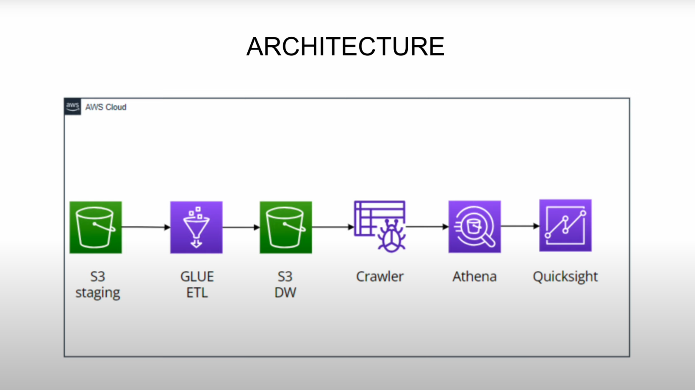

# Spotify Data Pipeline on AWS

## Project Overview
This project demonstrates the setup of a serverless data pipeline on AWS for processing Spotify data. It utilizes AWS services such as S3, Glue, Athena, and QuickSight to automate the extraction, transformation, and loading (ETL) of data, and then provides real-time analytics and visualization.

### Key Features:
- **ETL Process with AWS Glue**: Automates the transformation of Spotify data, including joining multiple datasets and removing redundant columns.
- **Data Storage with S3**: Raw data is uploaded to the S3 **staging** folder, then processed data is moved to the **datawarehouse** folder in Parquet format.
- **Querying with Athena**: Allows users to run SQL queries on the transformed data stored in S3.
- **Data Visualization with QuickSight**: Interactive dashboards to analyze music trends and gain insights from the dataset.

## Architecture
The architecture for the project is as follows:
1. **S3 Staging**: Raw data is stored in the S3 **staging** folder.
2. **AWS Glue**: ETL jobs in AWS Glue clean, join, and prepare the data.
3. **Athena**: SQL queries are run on the data stored in S3 using Athena.
4. **QuickSight**: Dashboards and analytics using QuickSight for data visualization.

### Architecture Diagram

## Technologies Used:
- **AWS S3**: Data storage
- **AWS Glue**: ETL jobs
- **AWS Athena**: Querying data stored in S3
- **AWS QuickSight**: Data visualization
- **Python**: Script development for Glue jobs and data processing
- **IAM Roles**: Used to grant necessary permissions to AWS services

## Dataset
The dataset used in this project is from [Kaggle - Spotify Dataset 2023](https://www.kaggle.com/datasets/tonygordonjr/spotify-dataset-2023). It contains information about tracks, albums, artists, and other metadata relevant to Spotify.

### Example Dataset Preview:

## Steps to Run the Project

1. **Set Up AWS Resources:**
   - Create a **S3 bucket** (`project-spotify-dataeng`) with folders `staging` and `datawarehouse`.
   - Create an IAM role with the necessary permissions for AWS Glue and S3.
   - Set up **AWS Glue jobs** for data transformation (using Python scripts).
   - Create an **AWS Glue Crawler** to catalog the data into the **spotify** database.
   - Set up **Athena** to query data stored in S3 and output the results to a specific output bucket.

2. **Run the ETL Job:**
   - Trigger the Glue ETL job to join and clean the data. The job will process the data and store the cleaned data in the **datawarehouse** folder on S3.
### ETL Preview:

### Job Monitoring Preview:

3. **Query the Data:**
   - Use **Athena** to run queries on the transformed data stored in the **datawarehouse** folder in S3.
   - Store the output of Athena queries in an S3 bucket for further analysis.

4. **Create Visualizations:**
   - Set up **QuickSight** to connect to the Athena data source and create interactive dashboards.

### Example Query Results in Athena:

5. **Data Visualization with QuickSight:**
   - Use **QuickSight** to generate visual insights from the queried data, such as trends in music listening.

### Example of Visualization in QuickSight:

